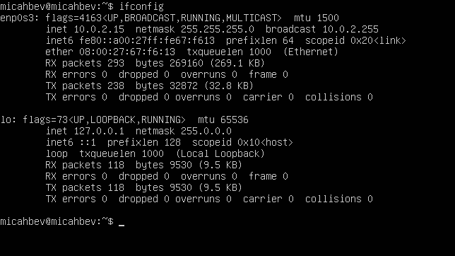
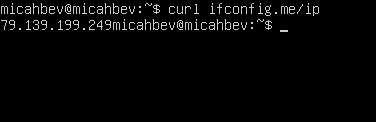
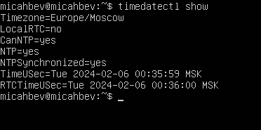
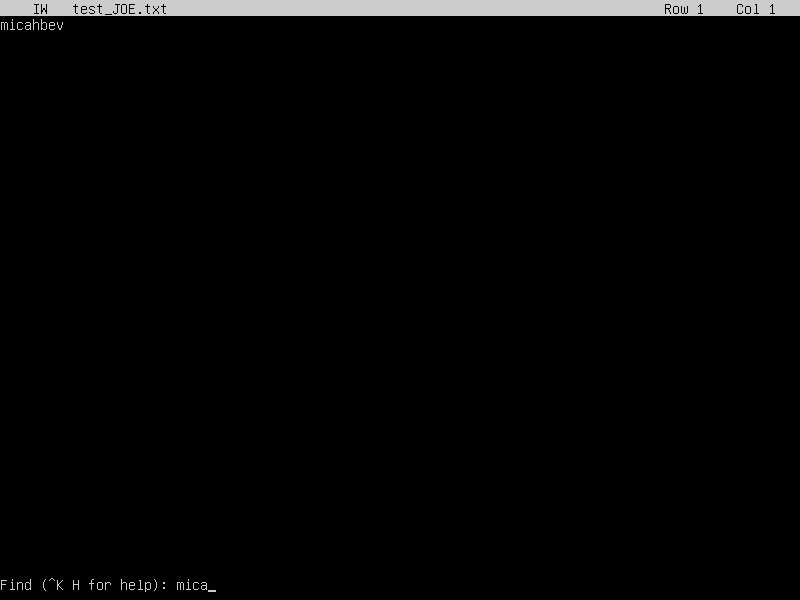
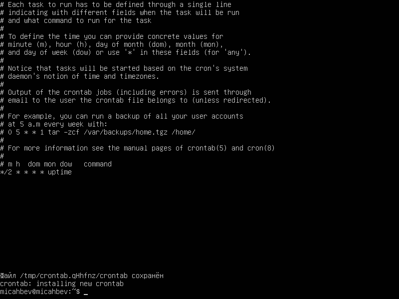

## Part 1. Установка ОС

- ``Смотрим версию Ubuntu после установки `` 
 

---

## Part 2. Создание пользователя
- ``Создаём пользователя и назначаем ему группу adm`` 
 

- ``Вывод списка пользователей (новый юзер в конце списка)`` 
 

---

## Part 3. Настройка сети ОС

- ``Установили новое имя машины и вывели его в терминал`` 
 

- ``Установили новую временную зону и вывели информацию в терминал`` 
 

- ``Устанавливаем набор сетевых инструментов`` 
 
``Выводим информацию о сетевых интерфейсах`` 
 
**lo (loopback device)** – виртуальный интерфейс, присутствующий по умолчанию в любом Linux. Он используется для отладки сетевых программ и запуска серверных приложений на локальной машине. С этим интерфейсом всегда связан адрес 127.0.0.1. У него есть dns-имя – localhost.

- ``Удалили старый и получили новый ip от dhcp сервера`` 
 
**DHCP - Dynamic Host Configuration Protocol**

- ``Узнали внешний IP-адрес`` 
 

- ``Узнали внутренний IP-адрес шлюза, он же ip-адрес по умолчанию`` 
 

- ``Изменили файл /etc/netplan/*.yaml, применили изменения в netplan, сделали ребут`` 
 
 
- ``Проверяем, что адреса соотсветствуют заданным в предыдущем пункте`` 
 
- ``Успешно пропинговали удаленные хосты 1.1.1.1 и ya.ru`` 
 

---

## Part 4. Обновление ОС
- ``Успешно обновили системыне пакеты`` 
 

---

## Part 5. Использование команды sudo
- **sudo** - позволяет временно поднимать привилегии и выполнять задачи администрирования системы с максимальными правами 
``Добавили пользователя в группу с привилегиями sudo, переключились на этого пользователя и поменяли hostname`` 
 

---

## Part 6. Установка и настройка службы времени
- ``Вывод команды с корректным временем`` 
 
 

---
юююююююююю
## Part 7. Установка и использование текстовых редакторов
- ``**VIM** Для сохранения и выхода нажал ESC и прописал :wq и имя документа`` 
 

- ``**NANO** Для сохранения нажал ^O, ввёл имя файла и подтвердил. Вышел через ^X`` 
 
- ``**JOE** Для сохранения и выхода нажал ^KX, ввёл имя файла и подтвердил.`` 
 

- ``**VIM** Для выхода без сохранения ESC -> :q! -> ENTER`` 
 
- ``**NANO** Для выхода без сохранения ^X -> N`` 
 
- ``**JOE** Для выхода без сохранения ^C -> y`` 
 
- ``**VIM** Для поиска: /что_ищем`` 
 
 
- ``**VIM** Для замены: :s/что_заменить/чем`` 
 
 
- ``**NANO** Для поиска: ^W -> что ищем`` 
 
 
- ``**NANO** Для замены: ^\ -> что заменить -> чем -> Y`` 
 
 
- ``**JOE** Для поиска: ^K F -> что ищем -> I`` 
 
 
- ``**JOE** Для замены: ^K F -> что заменить -> R -> чем -> Y`` 
 
 
 

---

## Part 8. Установка и базовая настройка сервиса SSHD
- ``Установил openssh-server и настроил конфиг`` 
- ``Выполнил sudo systemctl start sshd`` 
- ``Выполнил sudo systemctl enable sshd`` 
- ``Отобразил наличие процесса`` 
**ps** - выводит сведения о процессах в статическом виде 
**-e** - позволяет выбрать все процессы 
**| grep sshd** - поиск по выводу через пайп 
 
- ``reboot`` 
- ``netstat -tan`` 
 
**-tan**:  
-a -	Показывать состояние всех сокетов; обычно сокеты, используемые серверными процессами, не показываются. 
-n - Показывать сетевые адреса как числа. netstat обычно показывает адреса как символы. 
-t - Отображать TCP подключения 
**Proto** - Содержит тип протокола 
**Recv-Q** - Счётчик байтов не скопированных программой пользователя из этого сокета. 
**Send-Q** - Счётчик байтов, не подтверждённых удалённым узлом. 
**Local Address** - Адрес и номер порта локального конца сокета. 
**Foreign Address** - Адрес и номер порта удалённого конца сокета. 
**State** - Состояние сокета.  
LISTEN Сокет ожидает входящих подключений.  
SYN_SENT Сокет, находящийся в режиме активной попытки установки подключения. 
0.0.0.0 -  это немаршрутизируемый адрес IPv4, который используется в качестве адреса по умолчанию или адреса-заполнителя.

---

## Part 9. Установка и использование утилит top, htop
- Uptime: 7 min 
- 1 user 
- Load average: 0.03, 0.07, 0.06 
- Tasks: 95 total 
- %Cpu(s): 0.3 us, 0.3 sy, 0.0 ni, 99.3 id, 0.0 wa, 0.0 hi, 0.0 si, 0.0 st 
- MiB Mem: 965.1 total, 297.6 free, 148.4 used, 519.1 buff/cache 
- PID 1231 
 

- ``htop сортировка по PID`` 
 
- ``htop сортировка по PERCENT_CPU`` 
 
- ``htop сортировка по PERCENT_MEM`` 
 
- ``htop сортировка по TIME`` 
 
- ``htop фильтр по процессу sshd`` 
 
- ``htop поиск процесса syslog`` 
 
- ``htop с добавленным выводом hostname, clock и uptime`` 
 

---

## Part 10. Использование утилиты fdisk
- Disk /dev/sda, size: 8 GiB, 8589934592 bytes, 16777216 sectors 
 

---

## Part 11. Использование утилиты df
 
bytes
 
ext4

---

## Part 12. Использование утилиты du
- ``du command:`` 
 
- ``/home:`` 
 
- ``/var:`` 
 
- ``/var/log/*:`` 
 

---

## Part 13. Установка и использование утилиты ncdu
- ``Установка`` 
 
- ``/home`` 
 
- ``/var`` 
 
- ``/var/log`` 
 

---

## Part 14. Работа с системными журналами
- ``Напиши в отчёте время последней успешной авторизации, имя пользователя и метод входа в систему.`` 
- ``13:51:07 micahbev root `` 
- ``Перезапуск OpenSSH Server`` 
 

---

## Part 15. Использование планировщика заданий CRON
- ``Создание задачи в cron`` 
 
- ``uptime каждые 2 минуты`` 
 
- ``Вывели список задач`` 
 
- ``Удалили все задачи вывели список`` 
 
